# AI Agent Central - Enterprise AI Governance
> [!NOTE]
> Built on Microsoft’s Agent Readiness Framework
>
> Ver 1.0.0.13 updated with AI Goals and KPIs for Agents

Microsoft defines agent readiness as an organization’s ability to **design, deploy, and integrate AI agents effectively and at scale relative to enterprise objectives**, and frames readiness as an integration of **strategic vision and operational execution** across **five pillars**.
This framework was featured at **Microsoft Ignite 2025** as practical guidance to help organizations assess and accelerate readiness for agents at scale.

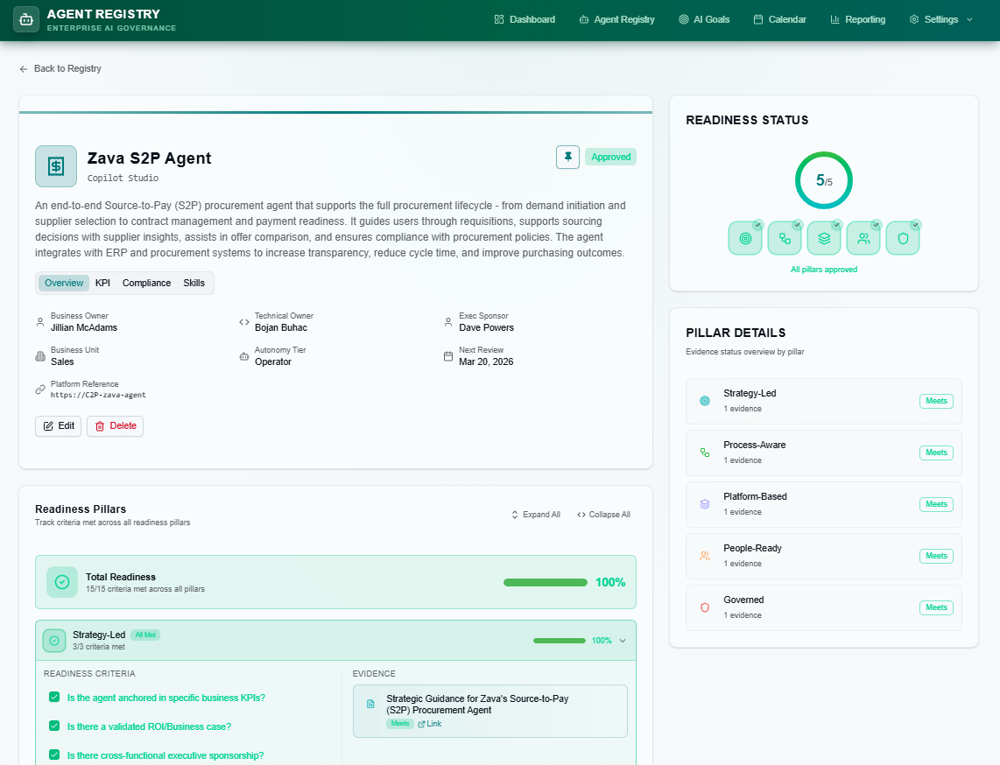
> [!NOTE]
> ### Agent readiness framework origins
> To assess organizational readiness for designing, developing, deploying, and scaling agentic AI solutions, Microsoft surveyed 500 decision-makers and influencers across 13 countries and 16 industries.
> 
> 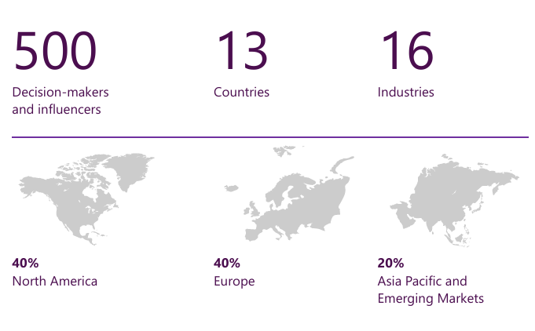
> 
> The sample includes organizations with 1,000 to 100,000+ employees and $1 billion to $50 billion+ annual revenue. Geographically, the study covered North America (40%), Europe (40%), and Asia Pacific and Emerging Markets (20%). All participating organizations reported familiarity with AI and had begun implementing foundational strategies and tools to support enterprise-scale adoption. Survey respondents answered 25 questions, each mapping to the five agentic pillars. Scores were aggregated and weighted to create a **Strategy Readiness** score (Business and AI Strategy Alignment, Business Process Mapping) and **Execution Readiness** score (Technology and Data Foundation, Organizational Readiness and Culture, Governance & Protections), which together produced an **Overall Agent Readiness Score**.
> 
> [The Agent Readiness Framework: Pillars & Practices](https://marketingassets.microsoft.com/gdc/gdcwrwKVr/original)
>  
> [Agent Readiness Framework](https://adoption.microsoft.com/files/agents/AgenticReadinessFrameworkOverview.pdf)  

### Five pillars (framework → product implementation)

The Agent Readiness Framework describes five pillars commonly presented as:
1. **Business & AI Strategy** 
2. **Business Process Mapping** 
3. **Technology & Data Foundation**
4. **Organizational Readiness & Culture**
5. **Security & Governance** 

Agent Registry implements these as **five operational readiness pillars** used throughout the UI:

| Product Pillar (UI) | Framework Alignment | What Agent Registry Enforces |
|---|---|---|
| **Strategy‑Led** | Business & AI Strategy | Captures business intent, sponsorship, success criteria, and alignment to enterprise objectives.|
| **Process‑Aware** | Business Process Mapping | Structures workflow context and evidence so agents operate within defined process boundaries.|
| **Platform‑Based** | Technology & Data Foundation | Tracks platform choices and references to support scalable, enterprise-approved deployment foundations.|
| **People‑Ready** | Organizational Readiness & Culture | Encourages adoption planning and readiness artifacts that build trust and enable responsible rollout.|
| **Governed** | Security & Governance | Evidence-backed controls, accountability, and review cadence to support safe, compliant scaling.|

> **Why this matters:** The framework’s value is in connecting **strategy readiness** (strategy + process) with **execution readiness** (technology/data + culture + governance), and Agent Registry is built to make that connection explicit through evidence and lifecycle controls.

---

## What you can do with Agent Registry

### ✅ Manage AI Goals and KPIs
- Manage AI Goals
- Manage KPIs
- Connect them to Agents

### ✅ Central AI Agent Registry
- Browse a registry of agents with **search** and **filters** (e.g., **All Statuses**, **All Platforms**).
- View agents as cards with key metadata and status:
  - **Employee Self Service Agent** (In Review)
  - **Contoso C2P Agent** (Approved)
  - **Finance Analyzer** (Rejected)
  - **Marketing Guru** (Retired)
  - **HR Helper** (In Review)
  - **Support Copilot** (Draft)

### ✅ Register & Maintain Agent Records
- Register a new agent with **Basic Information**:
  - *Agent Name*
  - *AI Platform* (e.g., “Copilot Studio” is shown in an example)
  - *Autonomy Tier*
  - *Description*
  - *Platform Reference*
- Assign **Ownership & Governance** fields
- Maintain a **review schedule** with a **Next Review Date**.

### ✅ Check for upcoming review dates via calendar

### ✅ Five-Pillar Readiness Model (Evidence-Based)
Agent readiness is tracked across five pillars:

1. **Strategy‑Led** - aligned with business objectives and roadmap  
2. **Process‑Aware** - using approved workflows and automation  
3. **Platform‑Based** - built on approved enterprise platforms  
4. **People‑Ready** - training, change management, and adoption plans  
5. **Governed** - security, compliance, and monitoring frameworks  

Each pillar can be supported by **evidence items**. Evidence includes:
- Readiness pillar selection
- Evidence status (e.g., **Meets** is visible)
- Evidence title and description
- A documentation link (“Link to SharePoint, Confluence, or external documentation” is visible)

### ✅ Reporting Dashboard & Analytics
A dedicated **Reporting Dashboard** provides visual analytics such as:
- KPI tiles (examples shown): **Total Agents**, **Approved**, **Total Evidence**, **Avg Pillar Coverage**
- **Agent Status Distribution** chart (Draft / In Review / Approved / Rejected / Retired)
- **Pillar Readiness Overview** chart
- An “Agents Pillar Status” table showing pillar status per agent

## Typical workflow

1. **Register a new agent** (Basic Information + Ownership & Governance).
2. Provide **evidence** for readiness pillars.
3. Track readiness in the agent details view (readiness score and per‑pillar status are visible).
4. Use **Reporting** to monitor adoption and governance coverage.

---
## Prerequisites
1. Power Platform Environement with Dataverse
2. Administrative privileges in specific environment

## Deployment
1. Download [AI Agent Central - Solution App](https://github.com/BojanBuhac/AI-Agent-Central/blob/main/AIAgentsGovernanceHuB_1_0_0_4.zip)
2. Navigate to https://make.preview.powerapps.com
3. Click Solutions and select Import solution from command bar
4. Select AIAgentsGovernanceHuB_1_x_x_x.zip and follow the import Solution process
5. Publish solution artifacts - **https://make.preview.powerapps.com/environments/environment_GUID/solutions/**
6. Share App with users - **https://make.preview.powerapps.com/environments/environment_GUID/apps/** > click Share button on toolbar
   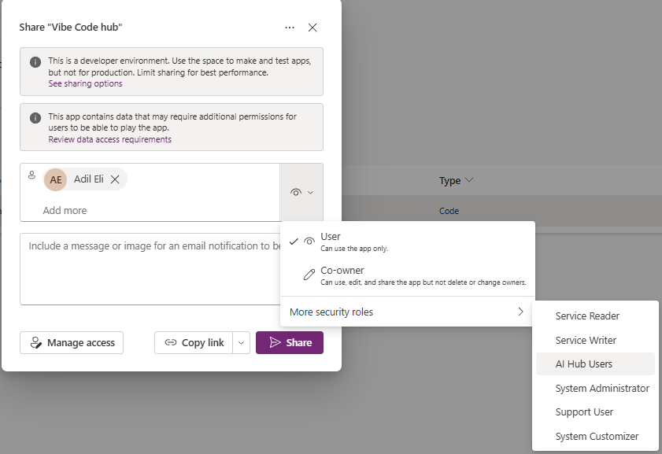

## Screenshots

### AI Agent Central
  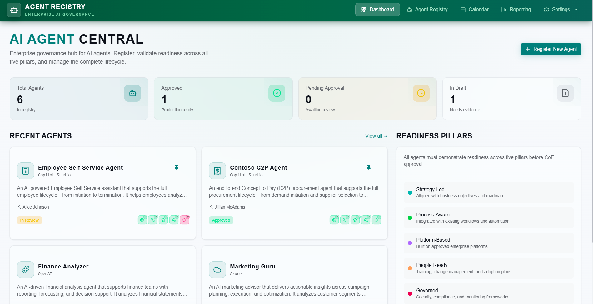

### AI Goals and KPIs
  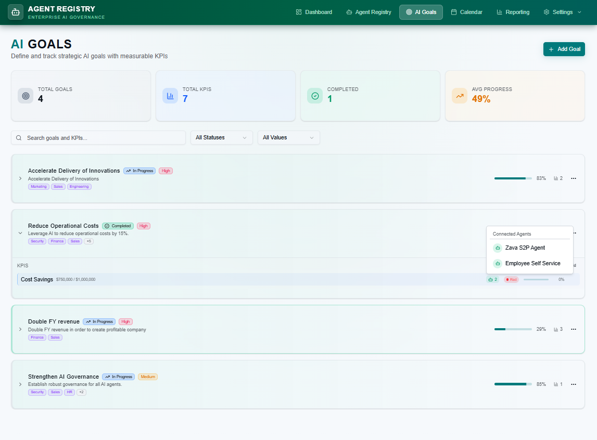

### Agent review calendar
  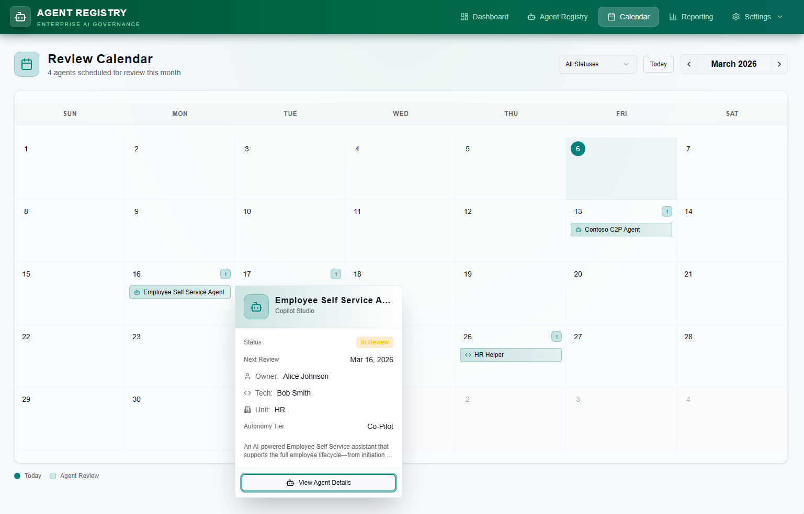
  
### Agent Details - General
  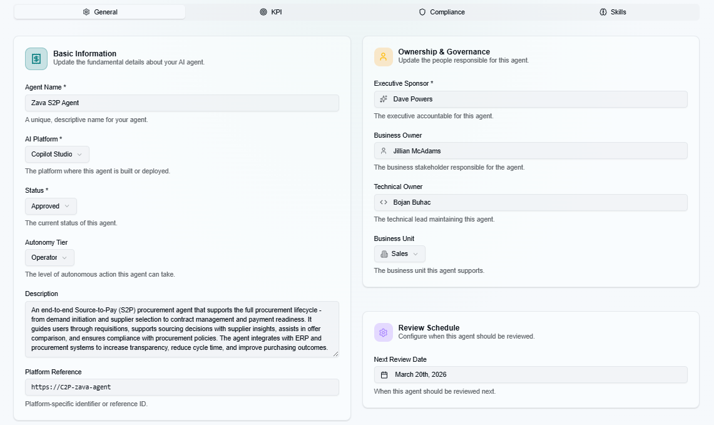

### Agent Details - KPIs
  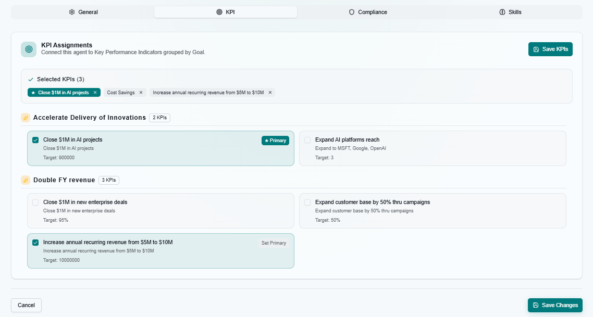

### Agent Details - Compliance
  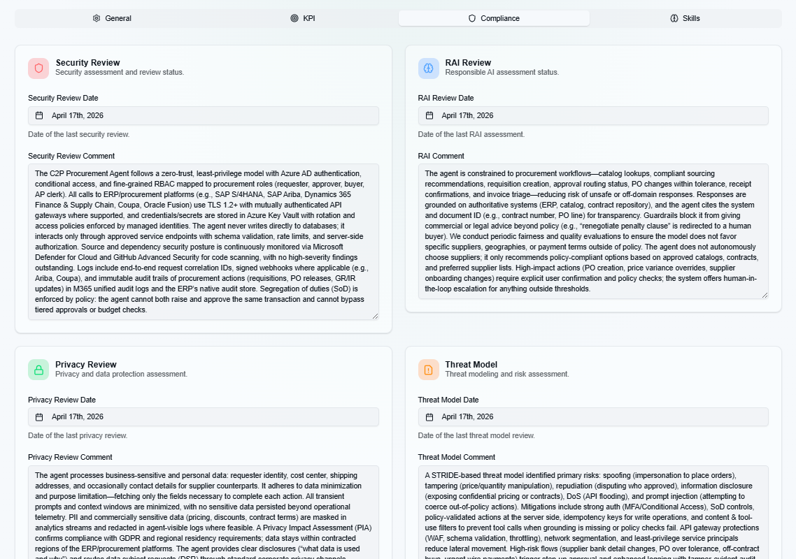

### Agent Details - Skills
  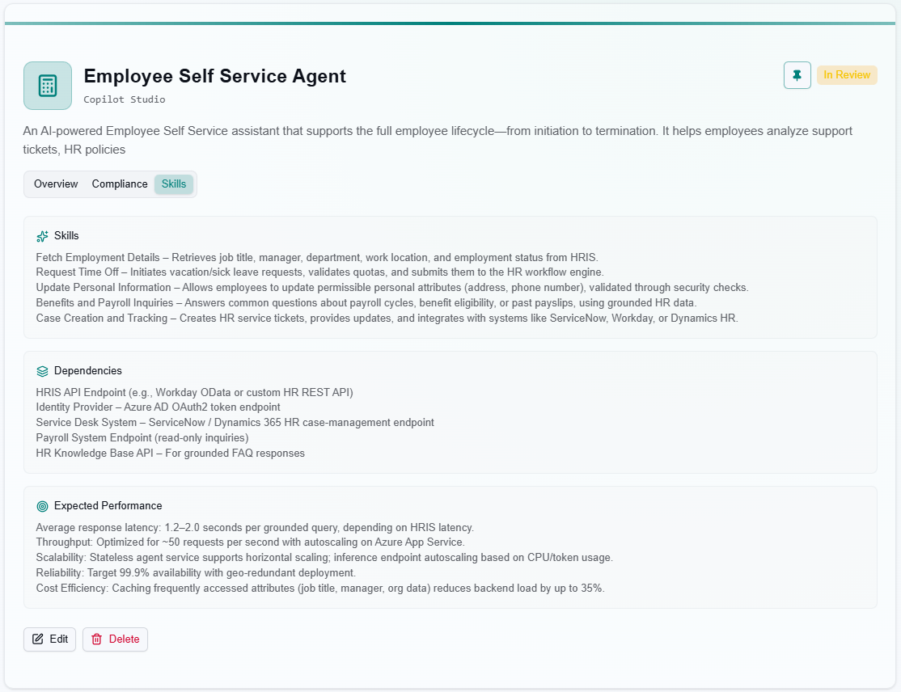

### Agent icon
  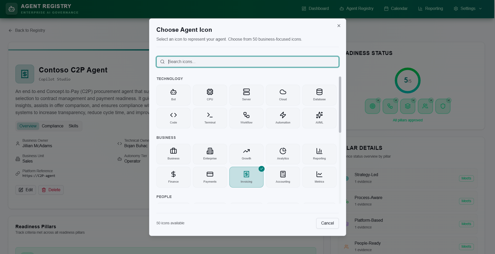

### Readiness & Pillar Details
  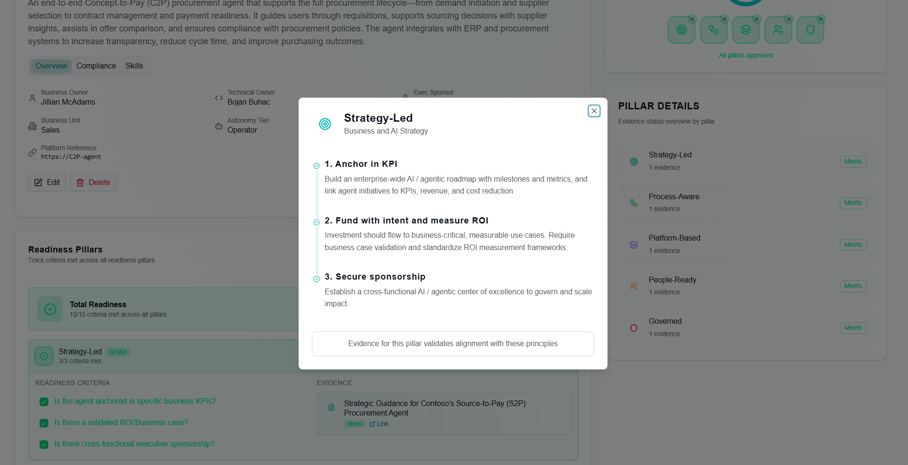

### Edit Evidence
  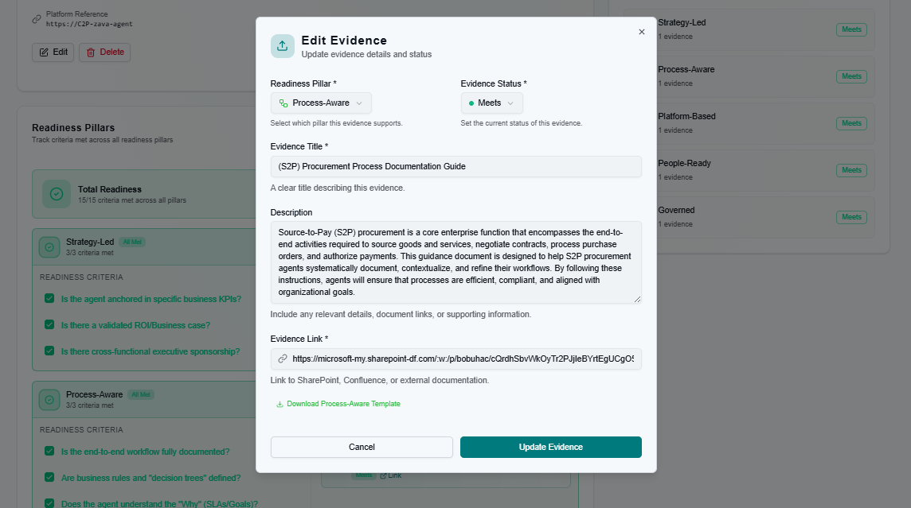

### Reporting Dashboard
 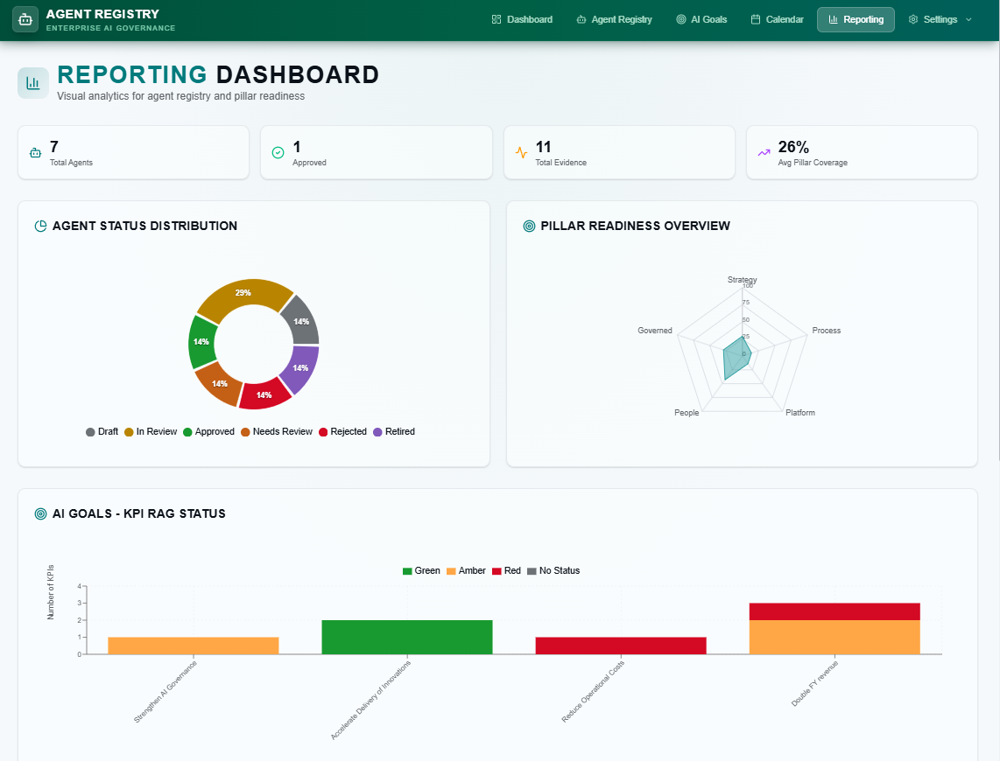

### Business Units
 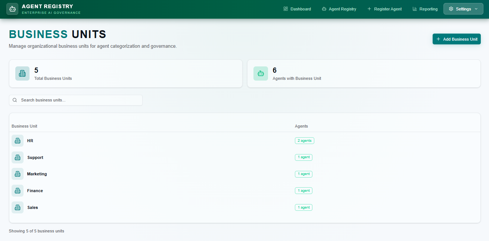

