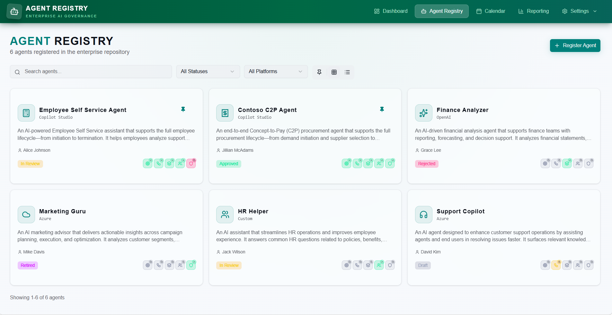
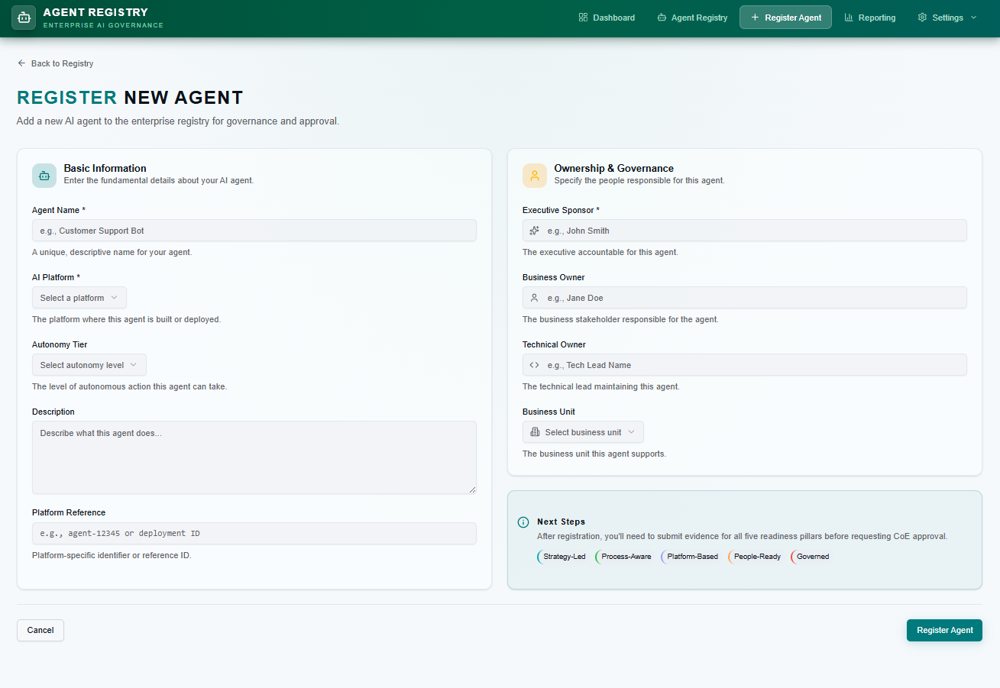
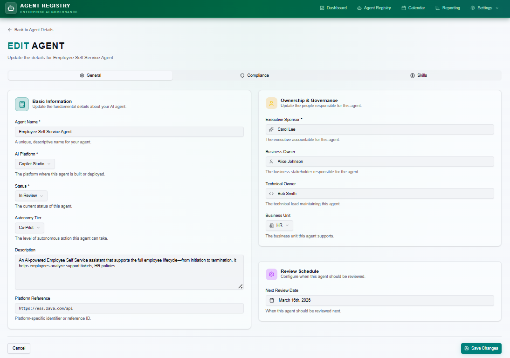
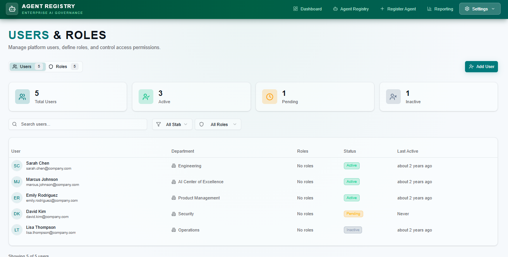

# AI Agent Central — Enterprise AI Governance

## Built on Microsoft’s Agent Readiness Framework (Ignite 2025)

Microsoft defines agent readiness as an organization’s ability to **design, deploy, and integrate AI agents effectively and at scale relative to enterprise objectives**, and frames readiness as an integration of **strategic vision and operational execution** across **five pillars**.
This framework was featured at **Microsoft Ignite 2025** as practical guidance to help organizations assess and accelerate readiness for agents at scale.

[The Agent Readiness Framework: Pillars & Practices](https://marketingassets.microsoft.com/gdc/gdcwrwKVr/original)
 
[Agent Readiness Framework](https://adoption.microsoft.com/files/agents/AgenticReadinessFrameworkOverview.pdf)  

### Five pillars (framework → product implementation)

The Agent Readiness Framework describes five pillars commonly presented as:
1. **Business & AI Strategy** 
2. **Business Process Mapping** 
3. **Technology & Data Foundation**
4. **Organizational Readiness & Culture**
5. **Security & Governance** 

Agent Registry implements these as **five operational readiness pillars** used throughout the UI:

| Product Pillar (UI) | Framework Alignment | What Agent Registry Enforces |
|---|---|---|
| **Strategy‑Led** | Business & AI Strategy | Captures business intent, sponsorship, success criteria, and alignment to enterprise objectives.|
| **Process‑Aware** | Business Process Mapping | Structures workflow context and evidence so agents operate within defined process boundaries.|
| **Platform‑Based** | Technology & Data Foundation | Tracks platform choices and references to support scalable, enterprise-approved deployment foundations.|
| **People‑Ready** | Organizational Readiness & Culture | Encourages adoption planning and readiness artifacts that build trust and enable responsible rollout.|
| **Governed** | Security & Governance | Evidence-backed controls, accountability, and review cadence to support safe, compliant scaling.|

> **Why this matters:** The framework’s value is in connecting **strategy readiness** (strategy + process) with **execution readiness** (technology/data + culture + governance), and Agent Registry is built to make that connection explicit through evidence and lifecycle controls.

---

## What you can do with Agent Registry

### ✅ Central AI Agent Registry
- Browse a registry of agents with **search** and **filters** (e.g., **All Statuses**, **All Platforms**).
- View agents as cards with key metadata and status (examples visible in the UI):
  - **Employee Self Service Agent** (In Review)
  - **Contoso C2P Agent** (Approved)
  - **Finance Analyzer** (Rejected)
  - **Marketing Guru** (Retired)
  - **HR Helper** (In Review)
  - **Support Copilot** (Draft)

### ✅ Register & Maintain Agent Records
- Register a new agent with **Basic Information**:
  - *Agent Name*
  - *AI Platform* (e.g., “Copilot Studio” is shown in an example)
  - *Autonomy Tier*
  - *Description*
  - *Platform Reference*
- Assign **Ownership & Governance** fields:
  - *Executive Sponsor*
  - *Business Owner*
  - *Technical Owner*
  - *Business Unit*
- Maintain a **review schedule** with a **Next Review Date**.

### ✅ Five-Pillar Readiness Model (Evidence-Based)
Agent readiness is tracked across five pillars (visible in the UI):

1. **Strategy‑Led** — aligned with business objectives and roadmap  
2. **Process‑Aware** — using approved workflows and automation  
3. **Platform‑Based** — built on approved enterprise platforms  
4. **People‑Ready** — training, change management, and adoption plans  
5. **Governed** — security, compliance, and monitoring frameworks  

Each pillar can be supported by **evidence items**. Evidence includes:
- Readiness pillar selection
- Evidence status (e.g., **Meets** is visible)
- Evidence title and description
- A documentation link (“Link to SharePoint, Confluence, or external documentation” is visible)

### ✅ Reporting Dashboard & Analytics
A dedicated **Reporting Dashboard** provides visual analytics such as:
- KPI tiles (examples shown): **Total Agents**, **Approved**, **Total Evidence**, **Avg Pillar Coverage**
- **Agent Status Distribution** chart (Draft / In Review / Approved / Rejected / Retired)
- **Pillar Readiness Overview** chart
- An “Agents Pillar Status” table showing pillar status per agent

### ✅ Users, Roles & Access
The product includes a **Users & Roles** area to manage access and permissions, including roles shown in the UI:
- **Agent Owner**
- **Repository Admin**
- **Portfolio Manager**
- **CoE Reviewer**
- **Consumer**

---

## Typical workflow (as shown in the UI)

1. **Register a new agent** (Basic Information + Ownership & Governance).
2. Provide **evidence** for readiness pillars.
3. Track readiness in the agent details view (readiness score and per‑pillar status are visible).
4. Use **Reporting** to monitor adoption and governance coverage.
5. Manage **Users, Roles**, and **Business Units** for consistent oversight.

---

## Screenshots

- **AI Agent Central (home)**
  

- **Agent Registry (list)**
  

- **Register New Agent**
  

- **Edit Agent**
  

- **Readiness & Pillar Details**
  

- **Edit Evidence (modal)**
  

- **Reporting Dashboard**
 

- **Users & Roles**
  

- **Business Units**
 

---

## Repository structure (recommended)
